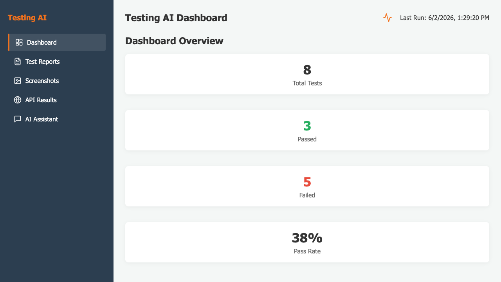
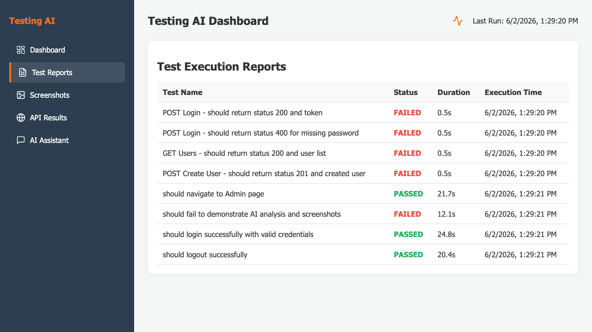
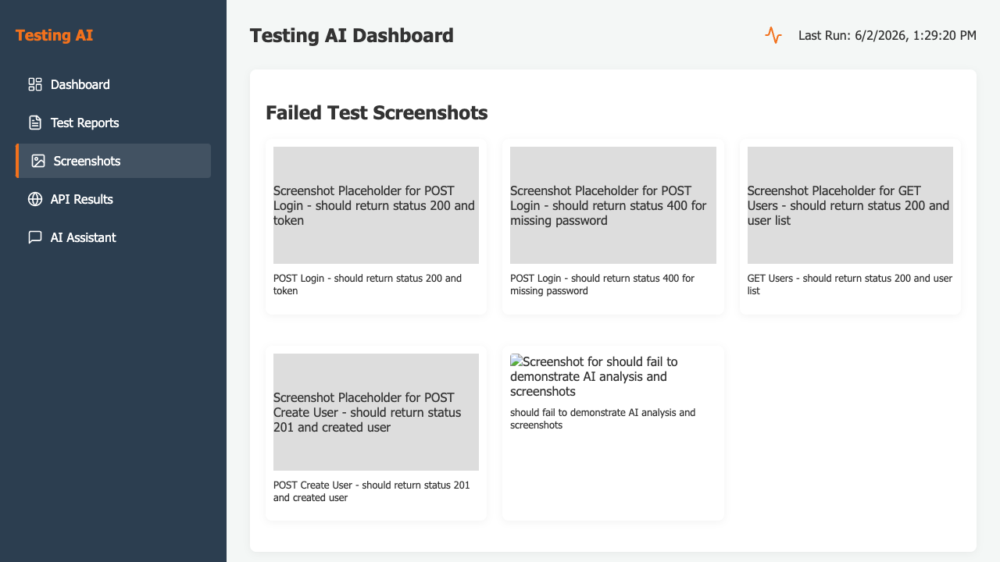
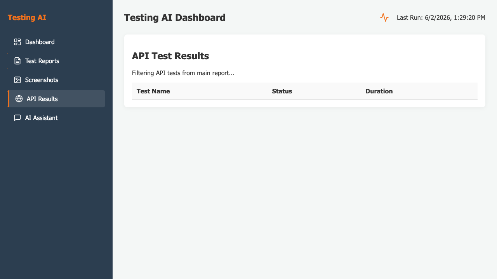
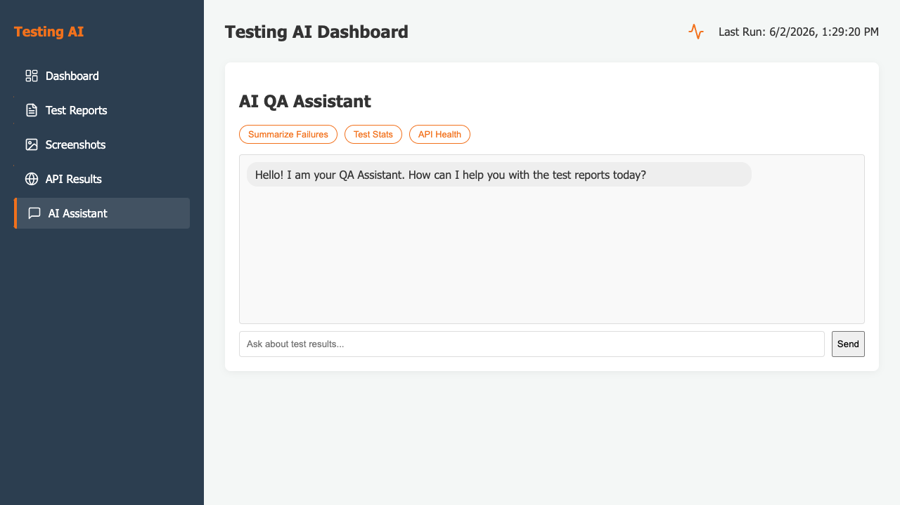

# Testing AI Dashboard

Professional QA Automation showcase project.

## Features

* **Playwright UI Automation**: Clean POM-based tests for the demo app.
* **Playwright API Testing**: REST API tests using ReqRes public API.
* **React Dashboard**: Modern reporting dashboard built with React and Vite.
* **AI Chat Assistant**: Integrated Gemini AI to analyze test reports and answer questions.

## UI Screenshots

<p align="center">
  
  <br>
  <em>Dashboard Overview</em>
</p>

<p align="center">
  
  <br>
  <em>Test Execution Reports</em>
</p>

<p align="center">
  
  <br>
  <em>Automated Test Screenshots</em>
</p>

<p align="center">
  
  <br>
  <em>API Testing Results</em>
</p>

<p align="center">
  
  <br>
  <em>Gemini AI Test Analysis Assistant</em>
</p>

## Project Structure

```text
testing-ai-dashboard/
├── automation/          # Playwright tests (JavaScript)
│   ├── api/            # API Test specs
│   ├── pages/          # Page Object Models
│   ├── scripts/        # Post-test processing (screenshots)
│   └── tests/          # UI Test specs
├── frontend/           # React Dashboard (TypeScript)
│   ├── src/
│   │   ├── components/ # Modular UI components
│   │   └── services/   # Gemini AI integration
│   ├── public/data/    # Test results data
├── reports/            # Test reports JSON/HTML
├── docs/screenshots/    # UI screenshots for README
└── README.md
```

## Workflow

1. **Run Tests**: Execute tests and automatically process results (copy screenshots).
   ```bash
   cd automation
   npm test
   ```

2. **Start Dashboard**: View the results and interact with the AI Assistant.
   ```bash
   cd frontend
   npm run dev
   ```

## Setup

### 1. Prerequisites
* Node.js (v18+)
* Gemini API Key

### 2. Install Dependencies
```bash
# Install automation dependencies
cd automation
npm install

# Install frontend dependencies
cd ../frontend
npm install
```

### 3. Environment Variables
Create a `.env` file in the `frontend` directory:
```env
VITE_GEMINI_API_KEY=your_gemini_api_key_here
```

## Running Tests

### UI & API Tests
```bash
cd automation
npx playwright test
```

### Show Report
```bash
npx playwright show-report
```

## Running Dashboard

```bash
cd frontend
npm run dev
```

## AI Integration

The dashboard includes an AI Assistant that can:
* Summarize test execution results.
* Identify failed tests.
* Provide insights into pass percentages.

Make sure to set your `VITE_GEMINI_API_KEY` to enable these features.
